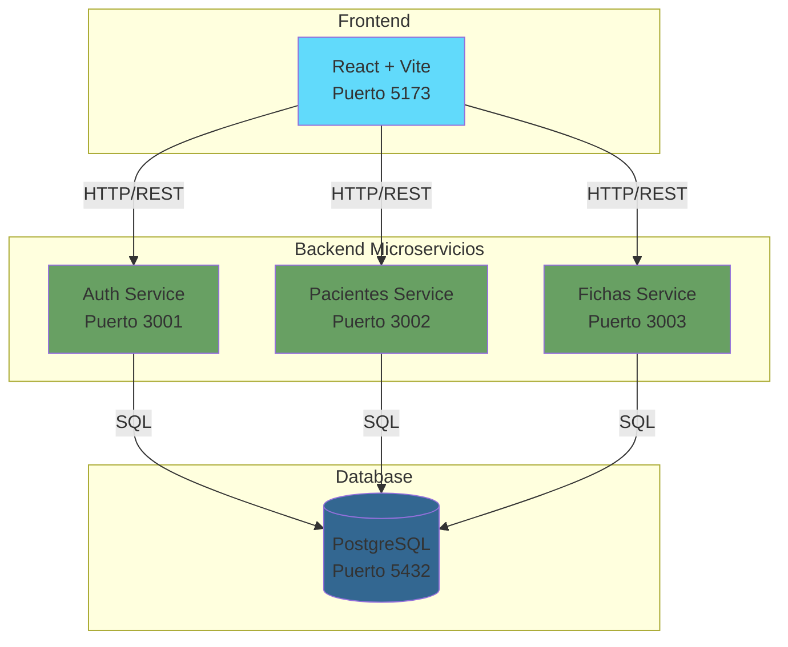
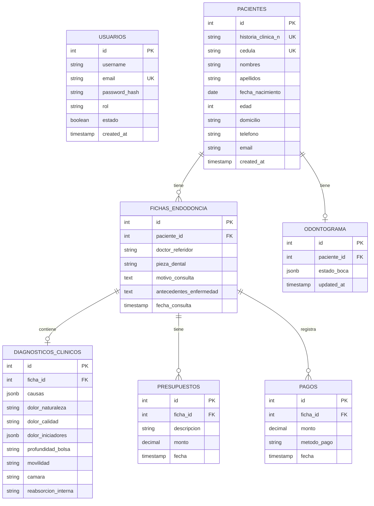

# 🦷 ENDONOVA - Sistema de Gestión Clínica Odontológica

Sistema de gestión integral para clínicas de endodoncia, desarrollado con arquitectura de microservicios.

## 📋 Tabla de Contenidos
- [Descripción](#descripción)
- [Arquitectura del Sistema](#arquitectura-del-sistema)
- [Tecnologías Utilizadas](#tecnologías-utilizadas)
- [Requisitos Previos](#requisitos-previos)
- [Instalación](#instalación)
- [Configuración](#configuración)
- [Ejecución](#ejecución)
- [Estructura del Proyecto](#estructura-del-proyecto)
- [API Endpoints](#api-endpoints)
- [Base de Datos](#base-de-datos)

## 🎯 Descripción

Endonova es una aplicación web completa para la gestión de clínicas odontológicas especializadas en endodoncia. Permite gestionar pacientes, fichas clínicas, odontogramas interactivos, diagnósticos, presupuestos y pagos.

### Características Principales
- ✅ Sistema de autenticación con JWT
- ✅ Gestión completa de pacientes (CRUD)
- ✅ Fichas clínicas endodónticas
- ✅ Odontograma interactivo (32 dientes)
- ✅ Diagnósticos clínicos detallados
- ✅ Control de presupuestos y pagos
- ✅ Dashboard con estadísticas en tiempo real
- ✅ Panel de administración de usuarios
- ✅ Documentación Swagger para cada API

## 🏗️ Arquitectura del Sistema



## 💻 Tecnologías Utilizadas

### Frontend
- **React** 18+ - Framework UI
- **Vite** 7.3+ - Build tool
- **React Router DOM** - Enrutamiento
- **Axios** - Cliente HTTP
- **Framer Motion** - Animaciones
- **React Hot Toast** - Notificaciones
- **React Icons** - Iconografía

### Backend
- **Node.js** - Runtime
- **Express** 5.2+ - Framework web
- **PostgreSQL** - Base de datos
- **JWT** - Autenticación
- **Bcrypt** - Encriptación de contraseñas
- **Swagger** - Documentación API
- **Nodemon** - Hot reload

## 📦 Requisitos Previos

Antes de instalar, asegúrate de tener:

- **Node.js** >= 18.x ([Descargar aquí](https://nodejs.org/))
- **PostgreSQL** >= 14.x ([Descargar aquí](https://www.postgresql.org/download/))
- **npm** >= 9.x (incluido con Node.js)
- **Git** (opcional, para control de versiones)

### Verificar instalaciones:
```powershell
node --version
npm --version
psql --version
```

## 🔧 Instalación

### 1. Clonar o descargar el proyecto

```powershell
cd "d:\6to Semestre D2\Aplicaciones Web\Proyecto IIB\Proyecto IIB\Endonova"
```

### 2. Instalar dependencias de todos los servicios

Ejecutar el script de instalación automática:
```powershell
.\scripts\install.ps1
```

O manualmente:
```powershell
# Frontend
cd frontend-react
npm install

# Microservicio Auth
cd ..\microservicio-auth
npm install

# Microservicio Pacientes
cd ..\microservicio-pacientes
npm install

# Microservicio Fichas
cd ..\microservicio-fichas
npm install
```

### 3. Configurar la Base de Datos

```powershell
# Iniciar sesión en PostgreSQL
psql -U postgres

# Crear la base de datos
CREATE DATABASE endonova;

# Conectarse a la base de datos
\c endonova

# Ejecutar el script SQL
\i scripts/database/schema.sql
\i scripts/database/seed.sql
```

O ejecutar el script automático:
```powershell
.\scripts\setup-database.ps1
```

## ⚙️ Configuración

### Variables de Entorno

Cada microservicio necesita un archivo `.env`. Puedes copiar los templates:

```powershell
.\scripts\setup-env.ps1
```

O crear manualmente:

#### **microservicio-auth/.env**
```env
PORT=3001
DB_USER=postgres
DB_HOST=localhost
DB_NAME=endonova
DB_PASSWORD=tu_contraseña
DB_PORT=5432
JWT_SECRET=endonova_secret_key_2026
```

#### **microservicio-pacientes/.env**
```env
PORT=3002
DB_USER=postgres
DB_HOST=localhost
DB_NAME=endonova
DB_PASSWORD=tu_contraseña
DB_PORT=5432
JWT_SECRET=endonova_secret_key_2026
```

#### **microservicio-fichas/.env**
```env
PORT=3003
DB_USER=postgres
DB_HOST=localhost
DB_NAME=endonova
DB_PASSWORD=tu_contraseña
DB_PORT=5432
JWT_SECRET=endonova_secret_key_2026
```

## 🚀 Ejecución

### Opción 1: Ejecución Manual (Desarrollo)

Abrir **4 terminales** y ejecutar:

```powershell
# Terminal 1 - Auth
cd microservicio-auth
npm run dev

# Terminal 2 - Pacientes
cd microservicio-pacientes
npm run dev

# Terminal 3 - Fichas
cd microservicio-fichas
npm run dev

# Terminal 4 - Frontend
cd frontend-react
npm run dev
```

### Opción 2: Ejecución Automática con Script

```powershell
# Ejecutar todos los servicios
.\scripts\start-all.ps1

# Detener todos los servicios
.\scripts\stop-all.ps1
```

### Opción 3: Docker Compose (Producción)

```powershell
docker-compose up -d
```

## 🌐 Acceso a la Aplicación

Una vez iniciados todos los servicios:

| Servicio | URL | Documentación |
|----------|-----|---------------|
| **Frontend** | http://localhost:5173 | - |
| **Auth API** | http://localhost:3001 | http://localhost:3001/api-docs |
| **Pacientes API** | http://localhost:3002 | http://localhost:3002/api-docs |
| **Fichas API** | http://localhost:3003 | http://localhost:3003/api-docs |

### Credenciales por defecto:
```
Email: admin@endonova.com
Password: admin123
```

## 📁 Estructura del Proyecto

```
Endonova/
├── frontend-react/              # Aplicación React
│   ├── src/
│   │   ├── components/          # Componentes reutilizables
│   │   ├── pages/              # Páginas/Vistas
│   │   └── services/           # API calls
│   └── package.json
│
├── microservicio-auth/         # Autenticación y usuarios
│   ├── src/
│   │   ├── controllers/        # Lógica de negocio
│   │   ├── routes/            # Definición de rutas
│   │   └── config/            # Configuraciones
│   └── package.json
│
├── microservicio-pacientes/    # Gestión de pacientes
│   └── src/
│
├── microservicio-fichas/       # Fichas y odontogramas
│   └── src/
│
├── scripts/                    # Scripts de configuración
│   ├── install.ps1
│   ├── start-all.ps1
│   ├── setup-env.ps1
│   └── database/
│       ├── schema.sql
│       └── seed.sql
│
├── docs/                       # Documentación
│   ├── arquitectura.md
│   └── database-diagram.md
│
├── docker-compose.yml          # Orquestación de contenedores
└── README.md
```

## 🔌 API Endpoints

### Auth Service (Puerto 3001)
| Método | Endpoint | Descripción |
|--------|----------|-------------|
| POST | `/api/auth/login` | Iniciar sesión |
| POST | `/api/auth/register` | Registrar usuario |
| GET | `/api/auth` | Listar usuarios |
| PUT | `/api/auth/:id/estado` | Activar/Desactivar usuario |

### Pacientes Service (Puerto 3002)
| Método | Endpoint | Descripción |
|--------|----------|-------------|
| GET | `/api/pacientes` | Listar todos |
| POST | `/api/pacientes` | Crear paciente |
| GET | `/api/pacientes/:id` | Obtener por ID |
| GET | `/api/pacientes/buscar/:cedula` | Buscar por cédula |
| PUT | `/api/pacientes/:id` | Actualizar |
| DELETE | `/api/pacientes/:id` | Eliminar |

### Fichas Service (Puerto 3003)
| Método | Endpoint | Descripción |
|--------|----------|-------------|
| POST | `/api/fichas/nueva` | Crear ficha |
| GET | `/api/fichas/:fichaId` | Obtener ficha completa |
| GET | `/api/fichas/paciente/:pacienteId` | Historial del paciente |
| PUT | `/api/fichas/diagnostico/:fichaId` | Actualizar diagnóstico |
| GET | `/api/fichas/odontograma/:pacienteId` | Obtener odontograma |
| POST | `/api/fichas/odontograma/:pacienteId` | Guardar odontograma |
| POST | `/api/fichas/presupuesto` | Agregar presupuesto |
| POST | `/api/fichas/pagos` | Registrar pago |
| GET | `/api/fichas/stats/resumen` | Estadísticas generales |
| GET | `/api/fichas/reporte/global` | Reporte de tratamientos |

## 🗄️ Base de Datos

### Modelo Entidad-Relación



### Tablas Principales

#### usuarios
Gestión de usuarios del sistema con roles y estados.

#### pacientes
Información personal y de contacto de los pacientes.

#### fichas_endodoncia
Registros de consultas endodónticas por paciente.

#### diagnosticos_clinicos
Evaluación clínica detallada de cada ficha (causas, dolor, movilidad, etc.).

#### odontograma
Estado visual de los 32 dientes (sano, caries, endodoncia, extracción).

#### presupuestos y pagos
Control financiero de tratamientos.

## 🛠️ Solución de Problemas

### Error: "Cannot connect to database"
- Verifica que PostgreSQL esté corriendo
- Revisa las credenciales en los archivos `.env`
- Confirma que la base de datos `endonova` existe

### Error: "Port already in use"
- Cierra otros procesos usando los puertos 3001-3003 o 5173
- O cambia los puertos en los archivos `.env`

### Error: "Token invalid"
- El token JWT expira después de 8 horas
- Vuelve a iniciar sesión

## 📝 Licencia

Este proyecto es desarrollado con fines académicos.

## 👥 Autores

Proyecto desarrollado para la asignatura de Aplicaciones Web - 6to Semestre D2

---

**Última actualización:** Enero 2026
